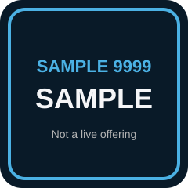

# ACS 9999: Sample Course

This syllabus is a living document. Hold down `SHIFT` and press Refresh to get the latest version.

> [!WARNING] SAMPLE COURSE
>
> This folder is the **filled sample** that proves [Syllabus-Template](https://github.com/droxey/Syllabus-Template) customization. Course Clerk tokens (`COURSE_*`, `REPO_NAME`, `GITHUB_ORG`) are replaced with concrete SAMPLE values.
>
> **This is not a live ACS offering.** Do not enroll, advertise, or treat ACS 9999 as a real Dominican / Tech-at-DU class. The blank starter stays at the **repo root**. Serve *this* folder to preview the filled site.

> [!NOTE] Instructor
>
> 

> 
Course Clerk / instructor setup (not student-facing)

>
> - Instructor: Dani Roxberry (`danielle.roxberry@dominican.edu`)
> - Org / repo convention: `droxey` / `sample-course`
> - Preview: `npx docsify-cli serve test/sample-course` from the Syllabus-Template root, or `npm install && npm run serve` inside this folder.
> - Root `AGENTS.md` placeholders stay empty on purpose. Only this SAMPLE is filled.
>
> 

<!-- omit in toc -->
## Table of Contents

1. [Course Description](#course-description)
1. [Prerequisites](#prerequisites)
1. [Course Specifics](#course-specifics)
1. [Learning Outcomes](#learning-outcomes)
1. [Schedule](#schedule)
1. [Class Assignments](#class-assignments)
1. [Evaluation](#evaluation)
1. [Class Recordings](#class-recordings)
1. [Information Resources](#information-resources)
1. [Interview Topics](#interview-topics)

## Course Description

In this **SAMPLE** course we ship a student-facing course site together. You will take a blank Docsify syllabus, fill it with real schedule and evaluation copy, then keep the site honest with reviews, checklists, and a short demo.

We are not studying Docker. ACS-3220 is the *layout* we copied. The modules here are course-ops: how a builder-teacher writes, reviews, and ships classroom docs.

### Why you should know this

Every class you take already *is* a product. If the syllabus is stale, the sidebar is a graveyard of leftover `Lesson 1` links, and nobody can preview the site locally, students pay for it. You will leave able to stand up a course repo you would actually send to a room.

## Prerequisites

- A GitHub account you can push to
- Comfort with a text editor and a terminal
- **SAMPLE prerequisite:** [ACS 1000: Intro to Building in Public](Resources/SampleGlossary.md) — fictional; linked so the sample syllabus has a real local target

## Course Specifics

**Course Delivery**: online | 7 weeks | 12 sessions 
**Course Credits**: SAMPLE — 3 units | 37.5 Seat Hours | 75 Total Hours

## Learning Outcomes

_By the end of this SAMPLE course, you will be able to&hellip;_

1. Identify and describe how a Docsify course site is structured (`index.html`, sidebar, syllabus, modules)
1. Explain how small PRs and reviews keep a course repo honest
1. Compare and contrast a blank Syllabus-Template clone with a filled course
1. Design and implement one student-facing module, then demo what shipped

## Schedule

**SAMPLE term dates:** Monday, March 2 – Wednesday, April 15, 2026 (7 weeks) 
**Class Times:** Monday, Wednesday at 4:00pm–5:30pm Pacific (12 class sessions)

| Class | Date | Topic |
|:-----:|:----:|-------|
| 1 | Mon, Mar 2 | [Module 1: Course Orientation] |
| 2 | Wed, Mar 4 | Module 1 lab — walk the repo and preview the site |
| 3 | Mon, Mar 9 | [Module 2: Version Control in the Small] |
| 4 | Wed, Mar 11 | Module 2 lab — branch, review, merge |
| 5 | Mon, Mar 16 | [Module 3: Docs as Product] |
| 6 | Wed, Mar 18 | Module 3 lab — rewrite one syllabus section |
| — | Mon, Mar 23 | **No Class — SAMPLE holiday (spring-break placeholder)** |
| 7 | Wed, Mar 25 | [Module 4: Feedback Loops] |
| 8 | Mon, Mar 30 | Module 4 lab — checklist + Gradescope-style submit |
| 9 | Wed, Apr 1 | [Module 5: Ship & Demo] |
| 10 | Mon, Apr 6 | [SAMPLE Project] studio |
| 11 | Wed, Apr 8 | [SAMPLE Project] studio |
| 12 | Wed, Apr 15 | Final presentations |

Five published lesson files cover the five modules. Lab days reuse the same module page — we do not invent empty `Lesson 12.md` stubs.

## Class Assignments

We will use [Gradescope](https://www.gradescope.com) for feedback. Submit assigned work there. Grades and comments come back there too.

Your Gradescope login is your school email. Set or reset your password at [https://www.gradescope.com/reset_password](https://www.gradescope.com/reset_password).

**SAMPLE Gradescope course:** there is no live roster. Treat the submit links below as demo targets.

### Tutorials

| Name | Description |
| ---- | ----------- |
| **Tutorial 1**: [Preview this sample locally](Guides/PreviewThisSite.md) | _Serve the filled site and confirm the sidebar matches the syllabus._ |
| **Tutorial 2**: [Docsify home](https://docsify.js.org/#/) | _Official Docsify docs — how the shell you copied actually works._ |

### Challenges

| Name | More info |
| ---- | --------- |
| **Challenge 1**: Name every Docsify file in this folder | [Instructions](Projects/SampleProject.md#challenge-1-map-the-shell) |
| **Challenge 2**: Open a SAMPLE pull request | [Instructions](Projects/SampleProject.md#challenge-2-open-a-sample-pr) |
| **Challenge 3**: Rewrite one module heading in teaching voice | [Instructions](Projects/SampleProject.md#challenge-3-one-heading-pass) |

### Projects

- [SAMPLE Project: Ship one module](Projects/SampleProject.md)

| Assignment | Date assigned | Due date | Submission |
|:----------:|:-------------:|:--------:|:----------:|
| [SAMPLE Project](Projects/SampleProject.md) | Wed, Apr 1 | Wed, Apr 15 | [Submit on Gradescope](https://www.gradescope.com) (demo only) |

## Evaluation

**To pass this SAMPLE course, you must**:

- Complete both tutorials
- Complete all three challenges
- Pass the [SAMPLE Project](Projects/SampleProject.md) against the [rubric](Projects/SampleRubric.md)
- Participate in class and follow the attendance policy
- Make up classwork from every absence

None of these gates enroll you in a real ACS section. They exist so the filled template shows a complete evaluation block.

## Class Recordings

Class recordings will be available at [Dani's SAMPLE recordings index](https://bit.ly/droxey-vids) no later than 24 hours after the session. Do not share recordings outside the course.

## Information Resources

- [SAMPLE glossary](Resources/SampleGlossary.md)
- [Preview / serve guide](Guides/PreviewThisSite.md)
- Root template clerk process: [`AGENTS.md`](../../AGENTS.md) in Syllabus-Template (not student-facing)

## Interview Topics

- Explain a Docsify course repo to someone who has only used Google Docs
- Describe a review you would refuse to merge (broken sidebar, leftover `COURSE_TITLE`)
- Walk through how you would preview a GitHub Pages syllabus before class

[Module 1: Course Orientation]: Lessons/Module1-Orientation.md
[Module 2: Version Control in the Small]: Lessons/Module2-VersionControl.md
[Module 3: Docs as Product]: Lessons/Module3-DocsAsProduct.md
[Module 4: Feedback Loops]: Lessons/Module4-FeedbackLoops.md
[Module 5: Ship & Demo]: Lessons/Module5-ShipAndDemo.md
[SAMPLE Project]: Projects/SampleProject.md
