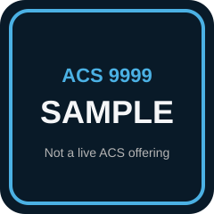

# ACS 9999: Sample Course

This syllabus is a living document. Hold down `SHIFT` and press Refresh to get the latest version.

> [!WARNING] SAMPLE COURSE
>
> This folder is the **filled sample** that proves [Syllabus-Template](https://github.com/droxey/Syllabus-Template) customization. Placeholder tokens (`COURSE_*`, `REPO_NAME`, `GITHUB_ORG`) are replaced with concrete SAMPLE values.
>
> **This is not a live ACS offering.** Do not enroll, advertise, or treat ACS 9999 as a real Dominican / Tech-at-DU class. The blank starter stays at the **repo root**. Serve *this* folder to preview the filled site.
>
> **Reading spine:** [Go 101](https://go101.org/article/101.html) and [Go Optimizations 101](https://go101.org/optimizations/101.html) on go101.org (Tapir Liu). We link the public site. We do **not** ship book PDFs in this repo.

> [!NOTE] Instructor
>
> 

> 
Instructor setup (not student-facing)

>
> - Instructor: Dani Roxberry (`danielle.roxberry@dominican.edu`)
> - Org / repo convention: `droxey` / `sample-course`
> - Preview: `npx docsify-cli serve test/sample-course` from the Syllabus-Template root, or `npm install && npm run serve` inside this folder.
> - Assign go101.org chapters. Do not paste book text into lessons.
> - Root `agents.md` placeholders stay empty on purpose. Only this SAMPLE is filled.
>
> 

<!-- omit in toc -->
## Table of Contents

1. [Course Description](#course-description)
1. [Prerequisites](#prerequisites)
1. [Course Specifics](#course-specifics)
1. [Learning Outcomes](#learning-outcomes)
1. [Schedule](#schedule)
1. [Class Assignments](#class-assignments)
1. [Evaluation](#evaluation)
1. [Class Recordings](#class-recordings)
1. [Information Resources](#information-resources)
1. [Interview Topics](#interview-topics)

## Course Description

In this **SAMPLE** course we learn Go the way a builder actually uses it: toolchain first, then values and types, then concurrency, then the few optimizations that matter.

The layout is ACS-3220's Docsify shell. The curriculum is a slim cut of [Go 101](https://go101.org/article/101.html) plus one week from [Go Optimizations 101](https://go101.org/optimizations/101.html). You read the official pages. Class time is I do → we do → you do, then a lab with a done state.

### Why you should know this

Go shows up in interviews and in production services. If you only memorize syntax, channels and escape analysis will surprise you. If you can run `go test`, explain a slice header, and say why a value escaped, you can ship.

## Prerequisites

- A programming language you have already written in (any)
- [The Go toolchain](https://go.dev/dl/) installed so `go version` prints a stable release
- **SAMPLE prerequisite:** [ACS 1000: Intro to Building in Public](resources/SampleGlossary.md) — fictional; linked so the sample syllabus has a real local target

## Course Specifics

**Course Delivery**: online | 7 weeks | 12 sessions 
**Course Credits**: SAMPLE — 3 units | 37.5 Seat Hours | 75 Total Hours

## Learning Outcomes

_By the end of this SAMPLE course, you will be able to&hellip;_

1. Identify and describe how the Go toolchain builds, tests, and modules a small program
1. Explain Go values: typed vs untyped, slice headers, and interface boxes
1. Compare and contrast channels vs `sync` for a given concurrency job
1. Design and implement a small Go tool, then name one allocation you would change and why

## Schedule

**SAMPLE term dates:** Monday, March 2 – Wednesday, April 15, 2026 (7 weeks) 
**Class Times:** Monday, Wednesday at 4:00pm–5:30pm Pacific (12 class sessions)

| Class | Date | Topic |
|:-----:|:----:|-------|
| 1 | Mon, Mar 2 | [Module 1: Toolchain] |
| 2 | Wed, Mar 4 | Module 1 lab — `go run` / `go test` |
| 3 | Mon, Mar 9 | [Module 2: Familiar Go] |
| 4 | Wed, Mar 11 | Module 2 lab — functions, control flow, a tiny CLI |
| 5 | Mon, Mar 16 | [Module 3: Type System] |
| 6 | Wed, Mar 18 | Module 3 lab — slices, maps, one interface |
| — | Mon, Mar 23 | **No Class — SAMPLE holiday (spring-break placeholder)** |
| 7 | Wed, Mar 25 | [Module 4: Concurrency] |
| 8 | Mon, Mar 30 | Module 4 lab — one channel pipeline |
| 9 | Wed, Apr 1 | [Module 5: Optimizations] |
| 10 | Mon, Apr 6 | [SAMPLE Project] studio |
| 11 | Wed, Apr 8 | [SAMPLE Project] studio |
| 12 | Wed, Apr 15 | Final presentations |

Five published lesson files cover the five modules. Lab days reuse the same module page.

## Class Assignments

We will use [Gradescope](https://www.gradescope.com) for feedback. Submit assigned work there. Grades and comments come back there too.

Your Gradescope login is your school email. Set or reset your password at [https://www.gradescope.com/reset_password](https://www.gradescope.com/reset_password).

**SAMPLE Gradescope course:** there is no live roster. Treat the submit links below as demo targets.

### Tutorials

| Name | Description |
| ---- | ----------- |
| **Tutorial 1**: [Preview this sample locally](guides/PreviewThisSite.md) | _Serve the filled site and confirm the sidebar matches the syllabus._ |
| **Tutorial 2**: [Go 101 home](https://go101.org/article/101.html) | _Official book index — this is the reading spine, not a PDF in the repo._ |

### Challenges

| Name | More info |
| ---- | --------- |
| **Challenge 1**: Run `go test` on a one-package repo | [Instructions](projects/sample_project.md#challenge-1-go-test) |
| **Challenge 2**: Draw a slice header vs its backing array | [Instructions](projects/sample_project.md#challenge-2-slice-header) |
| **Challenge 3**: Name one allocation you would keep or cut | [Instructions](projects/sample_project.md#challenge-3-one-allocation) |

### Projects

- [SAMPLE Project: Ship a small Go tool](projects/sample_project.md)

| Assignment | Date assigned | Due date | Submission |
|:----------:|:-------------:|:--------:|:----------:|
| [SAMPLE Project](projects/sample_project.md) | Wed, Apr 1 | Wed, Apr 15 | [Submit on Gradescope](https://www.gradescope.com) (demo only) |

## Evaluation

**To pass this SAMPLE course, you must**:

- Complete both tutorials
- Complete all three challenges
- Pass the [SAMPLE Project](projects/sample_project.md) against the [rubric](projects/sample_rubric.md)
- Participate in class and follow the attendance policy
- Make up classwork from every absence

None of these gates enroll you in a real ACS section. They exist so the filled template shows a complete evaluation block.

## Class Recordings

Class recordings will be available at [Dani's SAMPLE recordings index](https://bit.ly/droxey-vids) no later than 24 hours after the session. Do not share recordings outside the course.

## Information Resources

- [Go 101 reading map](resources/Go101.md)
- [SAMPLE glossary](resources/SampleGlossary.md)
- [Preview / serve guide](guides/PreviewThisSite.md)
- [Go 101](https://go101.org/article/101.html) and [Go Optimizations 101](https://go101.org/optimizations/101.html) — official site, Tapir Liu
- Root template clerk process: [`agents.md`](https://github.com/droxey/Syllabus-Template/blob/master/agents.md) in Syllabus-Template (not student-facing)

## Interview Topics

- Explain a slice header to someone who only knows arrays
- When you would pick a channel vs a mutex
- What “this value escaped to the heap” means in a `go build -gcflags=-m` line

[Module 1: Toolchain]: lessons/Module1-Toolchain.md
[Module 2: Familiar Go]: lessons/Module2-GoCode.md
[Module 3: Type System]: lessons/Module3-TypeSystem.md
[Module 4: Concurrency]: lessons/Module4-Concurrency.md
[Module 5: Optimizations]: lessons/Module5-Optimizations.md
[SAMPLE Project]: projects/sample_project.md
